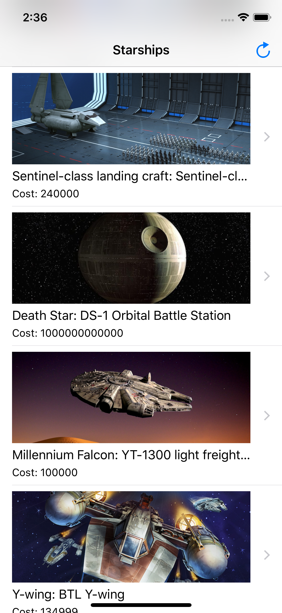
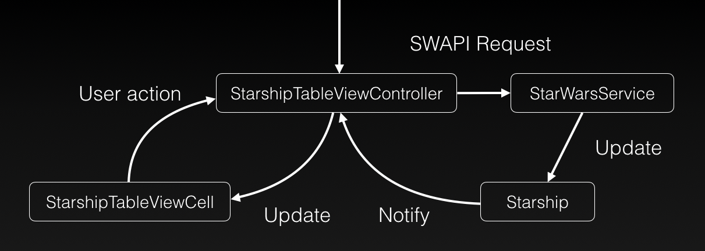
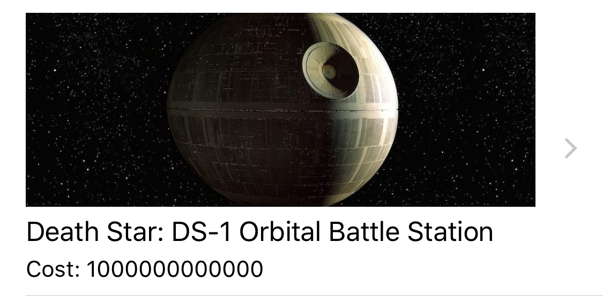

# Starter Codebase Walkthrough

#### Introduction

The base code provided here is built with the latest Swift and uses best practices for organization. Let's walk through it step by step.

The end goal is to produce an app that shows a list of starships in the Star Wars universe. The main view controller will look like this:

<div style="text-align:center"></div>

#### Data Source
We'll be pulling data from the open-source [Star Wars API (SWAPI)](https://swapi.co/). Play around with some of the requests to get a feel for the data we will work with.

#### Architecture
Here's our basic MVC architecture, with networking:

Model: `Starship`

View: `StarshipTableViewCell`

Controller: `StarshipTableViewController`

Networking: `StarWarsService`

## Model
Our models are in `Starship.swift`. The main one here is `Starship`:
```swift
struct Starship: Codable {
    let name: String
    let model: String
    let manufacturer: String
    let costInCredits: String
}
```
We've created this from the JSON response for a starship. You can see the request body here: [Death Star GET Request](https://swapi.co/api/starships/9). A preview is below:
```json
{
	"name": "Death Star",
	"model": "DS-1 Orbital Battle Station",
	"manufacturer": "Imperial Department of Military Research, Sienar Fleet Systems",
	"cost_in_credits": "1000000000000",
}
```
Notice that `cost_in_credits` is in snake case while `costInCredits` in our `Starship` `struct` is in lowerCamelCase. Swift's `Codable` protocol, which `Starship` conforms to, allows for automatic generation of the correct JSON keys when you turn on a specific option. We will cover that in the Networking section. However, for more custom initialization in Swift, check out the short writeup on [custom inits](./CustomInit.md).

Swift object types are `struct`s and `class`es. A `struct` is a value type, meaning copies have independent state and the data is thread safe. A `class` has shared, mutable state. `struct`s are more efficient in Swift and get certain functionality for free, like initializers.

The other model in `Starship.swift` is `Starships`. This models our response from the server when getting multiple `Starship`s.
```swift
struct Starships: Codable {
    let results: [Starship]
}
```
A preview of the response when hitting `/api/starships`:
```json
{
	"count": 37,
	"next": "https://swapi.co/api/starships/?page=2",
	"previous": null,
	"results": [
		{
			"name": "Executor",
			"model": "Executor-class star dreadnought",
			"manufacturer": "Kuat Drive Yards, Fondor Shipyards",
			"cost_in_credits": "1143350000",
		},
		{
			// another starship
		}
	]
}
```
So, `Starships` just has one property, `results`, that's an array of `Starship`. We could include other fields like `let count: Int` if we wanted, but that's unnecessary for the tutorial.

## Networking
Here's where we get to call the API and transform the response into an array of `Starship`. 

#### Result
When we call our API, we will get a result back. Swift 5 has a very useful data structure for this called `Result`, which is a generic enum with associated values. It enforces error handling and separate codepaths for success and failure at compile time.

From the Swift documentation:
```swift
public enum Result<Success, Failure> where Failure : Error {
    /// A success, storing a `Success` value.
    case success(Success)

    /// A failure, storing a `Failure` value.
    case failure(Failure)
}
```

This way, when we get a result, we can handle it in code clearly, with no chance of null pointer errors:
```swift
func handleResult(result: Result<[Starship], Error>) {
    switch result {
    case .success(let starships):
        // do something with the starships
        
    case .failure(let error):
        // handle the error
    }
}
```

#### Custom Error
If the system doesn't produce an error and you reach a failure case that you need to respond with an error, you can create a custom error type, like so:
```swift
enum StarWarsServiceError: Error {
    case dataNotFound
}
```
We will throw this error if there's an issue with the data received by the GET request.

#### GET Request
Let's take a look at how to write a GET request. You start by making a URL, create a request, and give the request to the shared `URLSession` for the system. When the `URLSession` receives a response, it will call a custom function that has parameters of type `Data?, URLResponse?, Error?`. We can define this function as a callback, an anonymous function sent as a parameter to another function.

```swift
func getStarships(completion: @escaping (Result<[Starship], Error>) -> Void) {
    
    let route = URL(string: "https://swapi.co/api/starships")!
    
    // Create a request. Properties of the request, like request.httpMethod and request.httpBody, allow you to do any type of HTTP request.
    let request = URLRequest(url: route)
    
    // Create a URL session data task with the request, and give code to execute upon response.
    let task = URLSession.shared.dataTask(with: request) { (data, response, error) in
        
        if let error = error {  // If there was an error, pass it back to the getStarships caller
            completion(.failure(error))
            
        } else if let data = data {  // If the data exists
            do {
                let decoder = JSONDecoder()
                decoder.keyDecodingStrategy = .convertFromSnakeCase
                
                let starships = try decoder.decode(Starships.self, from: data)
                completion(.success(starships.results))
                
            } catch {  // This will catch JSON decoder errors
                completion(.failure(error))
            }
            
        } else {  // If we're here, the data doesn't exist and we can return our custom error
            completion(.failure(StarWarsServiceError.dataNotFound))
        }
    }
    
    // Start the request. Can also use task.cancel() after the fact.
    task.resume()
    
}
```
To have a well-defined namespace for our functions, we can wrap this in a `struct` called `StarWarsService`, that will contain all your networking functions.

```swift
struct StarWarsService {
    func getStarships(completion: @escaping (Result<[Starship], Error>) -> Void) { ... }
}
```

## View
Each cell in our table view will show some information about a `Starship`, like this one for the Death Star:
<div style="text-align:center"></div>

It has an image view and two labels stacked together. We've connected these UI elements to the cell class, `StarshipTableViewCell`, using `@IBOutlet`s from the storyboard to the code.

Now, we need to write a function to set up the cell for a `Starship`. I like to call this function `configure`.

```swift
class StarshipTableViewCell: UITableViewCell {
    
    @IBOutlet weak var starshipImageView: UIImageView!
    @IBOutlet weak var nameLabel: UILabel!
    @IBOutlet weak var detailLabel: UILabel!

    override func awakeFromNib() {
        super.awakeFromNib()
        // Initialization code, like programmatically setting the background color of the cell
    }

    // Let the view update given a "view model", or some object that contains more or less formatted
    // data for each field in the view
    func configure(for starship: Starship) {
        starshipImageView.image = UIImage(named: starship.name) ?? UIImage(named: "placeholder.png")
        nameLabel?.text = starship.name + ": " + starship.model
        detailLabel?.text = "Cost: \(starship.costInCredits)"
    }

}
```
`configure` takes a `Starship` as a parameter, and sets the image view's image to the appropriate `UIImage` defined in your asset catalogue. It then concatenates strings to produce the text for the name and detail labels.

## Controller
The table view controller is the class that ties our model, networking and view together. Looking back at our diagram, we see how `StarshipTableViewController` coordinates app functionality:


#### Class Properties
We need two class-wide properties for our table view controller.
```swift
class StarshipTableViewController: UITableViewController {   
    let service = StarWarsService() // an instance of our network service
    var starships = [Starship]()  // an array of Starships the table will show
```
#### Integrating Networking
We need a function to start the GET request and handle the `Result`. The success case will set the class' `starships` property and tell the table view to reload.

```swift
func reloadStarships() {
    service.getStarships { result in
        // Must call this UI-updating code on the UI (main) thread
        DispatchQueue.main.async {
            switch result {
            case .success(let starships):
                self.starships = starships
                self.tableView.reloadData()
                
            case .failure(let error):
                self.presentAlert(withMessage: error.localizedDescription)
            }
        }
    }
}
```
`presentAlert` is a function that presents a popup alert to the user.
```swift
func presentAlert(withMessage message: String) {
    let alert = UIAlertController(title: "Error", message: message, preferredStyle: .alert)
    alert.addAction(UIAlertAction(title: "OK", style: .default, handler: { action in
        // this code is executed when the alert button is tapped
        print("OK button tapped, message: \(message)")
    }))
    self.present(alert, animated: true, completion: nil)
}
```
We need to kick off this GET request when the view controller's UI components are loaded into memory. One of the lifecycle functions on a view controller is `viewDidLoad()`. We will override it and call this function there.
```swift
override func viewDidLoad() {
    super.viewDidLoad()
    reloadStarships()
}
```
#### Table View Data Source
The table view loads data dynamically using functions instead of passing some kind of data adapter to the table. The three basic functions are `numberOfSections`, `numberOfRowsInSection`, and `cellForRowAtIndexPath`. We only need to override these and return the appropriate data from our `starships` class property.
```swift
override func numberOfSections(in tableView: UITableView) -> Int {
    return 1
}

override func tableView(_ tableView: UITableView, numberOfRowsInSection section: Int) -> Int {
    return starships.count
}

override func tableView(_ tableView: UITableView, cellForRowAt indexPath: IndexPath) -> UITableViewCell {
    let cell = tableView.dequeueReusableCell(withIdentifier: "starshipCell", for: indexPath) as! StarshipTableViewCell
    
    let starship = starships[indexPath.row]
    cell.configure(for: starship)
    
    return cell
}
```
In the last function, `cellForRowAtIndexPath`, we ask the table view for a reusable (recycled in Android vocab) cell. We reference a cell id, then cast it to our custom cell type, `StarshipTableViewCell`.

The `IndexPath` struct has a `section` and a `row`. This lets the view controller know which exact cell we're configuring. Since we only have 1 section, we only care about which row we're on. `numberOfRowsInSection` told the table view we have as many cells as we have `Starship`s in the `starships` property, so we can pass the appropriate `Starship` to the cell with:
```swift
let starship = starships[indexPath.row]
cell.configure(for: starship)
```

## Run Your App
That's all the code we need to get started. Besides designing your cell in `Main.storyboard` and connecting the storyboard elements to the right classes, these are the basic code concepts you need for a single-view app.

Next, we'll go through a few exercises to design a new table view controller and pass data between view controllers.

[Continue to the exercises](./Exercises.md)
