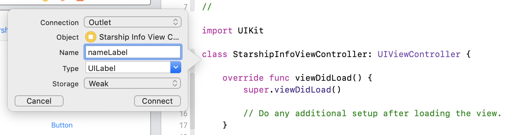

# Exercises
Start at the [Codebase Walkthrough](./CodebaseWalkthrough.md) to understand the repo! We'll be building on top of it.

There's a few simple exercises we'll go through to get you playing with Xcode and storyboards:

1. [Add a View Controller to the Storyboard](add-a-view-controller-to-the-storyboard)
2. [Create a Segue from the Main View Controller](create-a-segue-from-the-main-view-controller)
3. [Pass an Object to Your View Controller](Pass an Object to Your View Controller)
4. [Create a Custom View Controller Class](Create a Custom View Controller Class)
5. [Connect Your Storyboard to Your Class](Connect Your Storyboard to Your Class)
6. [Add a Label and Button](Add a Label and Button)
7. [Load Data from the Passed Model](Load Data from the Passed Model)


## Overview

We'll be adding a very simple info view controller that is presented when one of the starships in the table is tapped, then loads that starship's name when the button is tapped.
<div style="text-align:center"></div>


## Add a View Controller to the Storyboard
Start by opening `Main.storyboard`.

Then, click the Library button from the top right of Xcode:


Search for `view controller`, `UIViewController` or similar:

Drag a view controller onto the storyboard, to the right of the existing table view controller.

## Create a Segue from the Main View Controller
*Right click (control click) drag* from the controller icon of our table view controller to the view of the empty view controller you just created.

Select a `Show` manual segue when you let go of the click.

Now, select the segue you just created.


In the attributes inspector on the right side, give the segue an identifier like `showInfo`.


## Pass an Object to Your Segue
We're now going to implement a new function in the table view data source, one that's called when a cell is tapped. Add this under the `cellForRowAt indexPath` function.
```swift
override func tableView(_ tableView: UITableView, didSelectRowAt indexPath: IndexPath) {

    // Deselect right after select to get the "cell was just tapped once" animation
    self.tableView.deselectRow(at: indexPath, animated: true)
    
    let starship = starships[indexPath.row]
    
    // Sender is an arbitrary object you can send to the segue handler below.
    self.performSegue(withIdentifier: "showInfo", sender: starship)
}
```

## Create a Custom View Controller Class
Select `StarshipTableViewController.swift` in the file manager on the left of Xcode, so that your new file gets created in the `Controller` folder.

Then, go to `File > New > File` or press `command + N`. Choose `Cocoa Touch Class`. Make your new class a subclass of `UIViewController`, and name it `StarshipInfoViewController`. The creation screen will look like this:


Click `Next`, then click `Create` on the next prompt with the defaults left as they are.

## Connect Your Storyboard to Your Class
Now, we'll connect the new view controller we made to the `StarshipInfoViewController` class. This will let us design the view in the storyboard and populate the data with code.

Go back to `Main.storyboard` and click the view controller class icon on top of the view controller you created.


Now, select the Identity inspector on the right and assign your storyboard view controller the class `StarshipInfoViewController`.


## Add a Label and Button
Click the Library button again


...and drag a label and button onto the `StarshipInfoViewController`.


After dragging both onto the view controller's view, it should look like this:


Finally, add constraints to both the label and the button to center it in the view. Start by selecting both, then using the Align tool. Align both `Horizontally in Container` and click `Add 2 Constraints`.


The second set of constraints to add is on the label. Select your label, then add the 4 constraints pictured below: 100 from the top, 20 from the sides, 30 from the bottom.


#### Connect Your Views to Code
We need a way to reference the label and button from code. One of Xcode's coolest features is how it handles connecting code and interfaces.

##### Label

Open `Main.storyboard`. Hold **option** and click `StarshipInfoViewController.swift` to bring up the split editor view.


Right click drag from the label to inside the `StarshipInfoViewController` class.


Call the label reference `nameLabel` and click connect.


The inserted line should be `@IBOutlet weak var nameLabel: UILabel!`. You can see it highlighted in the next screenshot.

##### Button

Just like the label, we're going to right click drag the button into the code. This time, the connection will be an `Action` instead of an `Outlet`.


Call the action reference `updateLabel` and click `Connect`.


The whole `StarshipInfoViewController` class should now look like this:
```swift
class StarshipInfoViewController: UIViewController {
    @IBOutlet weak var nameLabel: UILabel!
    
    override func viewDidLoad() {
        super.viewDidLoad()

        // Do any additional setup after loading the view.
    }

    @IBAction func updateLabel(_ sender: Any) {
    }
    
    /*
    // MARK: - Navigation

    // In a storyboard-based application, you will often want to do a little preparation before navigation
    override func prepare(for segue: UIStoryboardSegue, sender: Any?) {
        // Get the new view controller using segue.destination.
        // Pass the selected object to the new view controller.
    }
    */

}
```

## Load Data from a Passed Model
#### Pass a Model into the Segue
Now, we'll send a `Starship` model to the new view controller. Edit your `didSelectRowAt indexPath` function in `StarshipTableViewController` to look like this:
```swift
override func tableView(_ tableView: UITableView, didSelectRowAt indexPath: IndexPath) {

    // Deselect right after select to get the "cell was just tapped once" animation
    self.tableView.deselectRow(at: indexPath, animated: true)
    
    let starship = starships[indexPath.row]
    
    // Sender is an arbitrary object you can send to the segue handler below.
    self.performSegue(withIdentifier: "ShowInfo", sender: starship)
}
```
Note that we're passing the `Starship` in the sender field of the segue.

#### Set Up the Info View Controller Class

To get it to `StarshipInfoViewController`, we have to give it a `starship` property first. In `StarshipInfoViewController.swift`, at the top of the class, add a variable.
```swift
class StarshipInfoViewController: UIViewController {
    
    var starship: Starship?  // <-- add this
    
    @IBOutlet weak var nameLabel: UILabel!
    
    override func viewDidLoad() {
```
Note that the type is `Starship?`. This is an optional, meaning it can be null (`nil` in Swift terms).

#### Send the Model through the Segue
Going back to `StarshipTableViewController.swift`, at the bottom of the file is a function called `prepare(for segue:)`. We use this to cast the segue destination to our custom type, and set the `starship` of the destination class, like this:
```swift
override func prepare(for segue: UIStoryboardSegue, sender: Any?) {
    // Get the new view controller using segue.destinationViewController.
    // Pass the selected object to the new view controller.
    if let destination = segue.destination as? StarshipInfoViewController, let starship = sender as? Starship {
        destination.starship = starship
    }
}
```

#### Set the Label of Your View Controller from the Model
In `StarshipInfoViewController.swift`, let's set the text of the label to the starship name when the button is pressed.

Go to the `updateLabel` function you created before, and set the relevant property.
```swift
@IBAction func updateLabel(_ sender: Any) {
    nameLabel.text = starship?.name ?? "Can't get name"
}
```
Adding the ` ?? "Can't get name"` sets a default if the `starship` is `nil`.

Build and run, and everything should be working.

<div style="text-align:center"></div>

To see the final repo with these changes, switch to the `StarshipInfoViewController` branch using git.

## All Done!
You got to design a view controller on the storyboard, pass your model to it and load the views with the model's data. This is a basic iOS workflow that developers use all the time!

I hope you enjoyed this simple but powerful iOS tutorial. Please see the [website](https://rcd.io/ios-uima) for this talk for more resources to help you learn Swift and iOS.